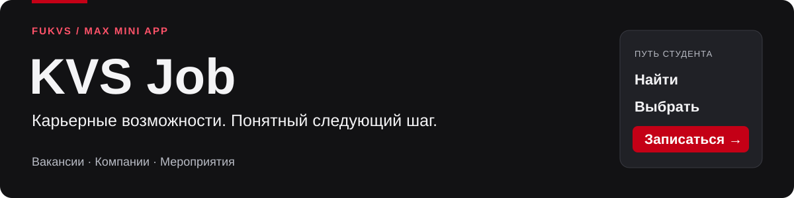
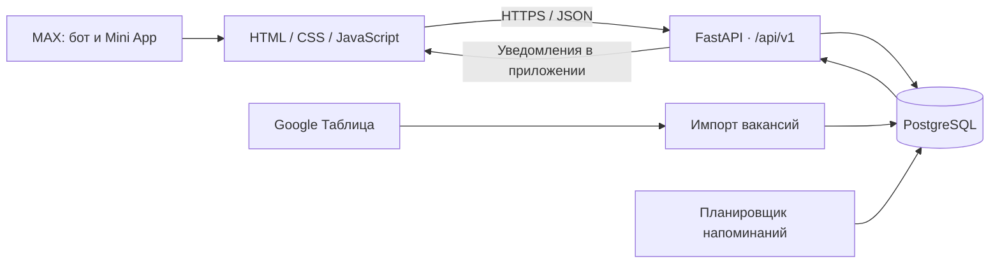

<p align="center">
  
</p>

<p align="center">
  <strong>Mini App для студентов Финансового университета</strong><br>
  Python 3.12 · FastAPI · PostgreSQL 15 · JavaScript · MAX Bridge
</p>

<p align="center">
  <a href="https://max.ru/t574_hakaton_max_bot">Бот в MAX</a> ·
  <a href="https://staging.allspace.com.ru/miniapp">Открыть приложение</a> ·
  <a href="https://staging.allspace.com.ru/docs">Swagger</a> ·
  <a href="#быстрый-старт">Запуск</a> ·
  <a href="#сценарий-проверки">Проверка</a>
</p>

---

## О проекте

**KVS Job** объединяет вакансии, компании-партнёры и карьерные мероприятия в одном интерфейсе MAX. Студент находит возможность, изучает условия, сохраняет вакансию или записывается на событие. Организатор публикует контент, управляет местами и общается с участниками.

**Команда Fukvs:** Ганенко Илья и Шестаков Ярослав. Проект подготовлен для хакатона «Образовательные решения».

| Студенту | Организатору |
| --- | --- |
| Поиск вакансий и фильтры по факультетам | Импорт вакансий из Google Таблицы |
| Карточки компаний и подразделений | Управление компаниями и событиями |
| Личное избранное | Лимит участников, основной список и резерв |
| Запись на мероприятие и отмена | Сообщения всем участникам или выбранной группе |
| Подтверждения и напоминания внутри приложения | Статистика действий и экспорт CSV |

### Основной сценарий

**Открыть MAX → войти в профиль → найти событие → зарегистрироваться → получить подтверждение и напоминание.**

При заполнении лимита студент попадает в резерв. Если место освобождается, первый участник резерва автоматически переводится в основной список. Напоминания основному списку создаются накануне после **19:00 МСК** и в пределах **двух часов до начала**, с учётом интервала проверки планировщика.

Уведомления доступны через колокольчик в Mini App. Личные сообщения от бота и системные push-уведомления в текущем сценарии не реализованы. Отклик на вакансию открывает адрес работодателя; трудоустройство приложение не подтверждает.

## Навигация

- [Доступ для жюри](#доступ-для-жюри)
- [Быстрый старт](#быстрый-старт)
- [Тестовые данные](#тестовые-данные)
- [Сценарий проверки](#сценарий-проверки)
- [Архитектура](#архитектура)
- [Переменные окружения](#переменные-окружения)
- [Внешние сервисы и интеграции](#внешние-сервисы-и-интеграции)
- [Работа с данными](#работа-с-данными)
- [Остановка и повторный запуск](#остановка-и-повторный-запуск)
- [Диагностика и ограничения](#диагностика-и-ограничения)
- [Комплект сдачи](#комплект-сдачи)

## Доступ для жюри

| Ресурс | Адрес |
| --- | --- |
| Бот в MAX | https://max.ru/t574_hakaton_max_bot |
| Mini App | https://staging.allspace.com.ru/miniapp |
| Собственный API | https://staging.allspace.com.ru/api/v1 |
| Swagger | https://staging.allspace.com.ru/docs |
| Проверка процесса | https://staging.allspace.com.ru/healthz |
| Контракт API | [openapi.yaml](openapi.yaml) |
| Описание проверок | [DATA-API.yaml](DATA-API.yaml) |

| Роль | Тестовый email | Пароль |
| --- | --- | --- |
| Студент | `student1@edu.fa.ru` | Не используется |
| Второй студент для проверки резерва | `student2@edu.fa.ru` | Не используется |
| Администратор | `253103@edu.fa.ru` | Не используется |

В разделе **«Профиль»** выберите вход и введите email. MVP допускает адреса домена `@edu.fa.ru`. Администратор определяется переменной `ADMIN_EMAIL`; ему доступна панель разработчика.

> **Граница демоверсии:** владение email не подтверждается; административный API использует заголовок `X-Admin-Email`. Это упрощённый механизм проверки MVP. До массового внедрения нужны подтверждение пользователя, серверные роли и разграничение доступа.

Для основного сценария на опубликованном стенде проверяющему не нужны токены или API-ключи. `MAX_BOT_TOKEN` нужен владельцу стенда для серверной интеграции с MAX; ключ Google — только для импорта из Таблиц. Рабочие секреты передаются отдельно по защищённому каналу.

**Фиксация версии перед сдачей:** указать окончательный репозиторий и полный commit hash на первом слайде презентации. Получить hash: `git rev-parse HEAD`. После дедлайна сохранить эту версию и доступность стенда. Ссылка на окончательный репозиторий будет добавлена командой.

## Быстрый старт

### Требования к окружению

- Docker Engine / Docker Desktop в режиме Linux containers и Docker Compose v2.
- Свободные порты **8000** и **15432** либо другие значения в `.env`.
- Доступ к реестру Docker, PyPI и `gu-st.ru` при первой сборке: Dockerfile устанавливает зависимости и сертификаты для клиента MAX.
- Python и Node.js на хосте не требуются. В образе — Python 3.12; интерфейс использует статические ES-модули без npm-сборки.

Все команды выполняются **в каталоге с `docker-compose.yml`**. Если открыта внешняя папка проекта, сначала перейдите в `kvs_career_bot`.

**1. Подготовить конфигурацию** — один раз, если `.env` ещё не создан:

```powershell
# Windows PowerShell
Copy-Item .env.example .env
```

```bash
# Linux / macOS
cp .env.example .env
```

Значения примера подходят для локального запуска. Не перезаписывайте настроенный `.env` при обновлении. Для проверки без Google Таблиц установите `VACANCY_SYNC_SCHEDULE_ENABLED=false`.

**2. Запустить все локальные компоненты одной командой:**

```bash
docker compose up --build
```

Compose запускает PostgreSQL, ждёт его готовности, создаёт недостающие таблицы и запускает веб-сервис. Для фонового режима: `docker compose up -d --build`.

**3. Открыть приложение:**

| Локальный адрес | Назначение |
| --- | --- |
| http://127.0.0.1:8000/miniapp | Интерфейс |
| http://127.0.0.1:8000/docs | Интерактивный API |
| http://127.0.0.1:8000/openapi.json | Контракт запущенного приложения |
| http://127.0.0.1:8000/healthz | Ответ `{"status":"ok","service":"kvs-job-miniapp"}` |

Пустой каталог вакансий или событий на новой БД ожидаем: подключите источник либо загрузите локальные тестовые данные следующим шагом. Карточки Kept и VK подготавливаются при инициализации; это содержимое демоверсии, а не заявление о партнёрстве с проектом.

### Порты и хранение

| Компонент | В контейнере | На хосте по умолчанию |
| --- | --- | --- |
| FastAPI, Mini App, Swagger | `8000` | `8000` (`MINIAPP_PORT`) |
| PostgreSQL | `5432` | `15432` (`DB_PORT`) |

Внутри Compose приложение подключается к `postgres:5432`: параметры подключения контейнера переопределены в compose-файле. PostgreSQL хранится в томе `postgres_data`; кэш изображений — `images_cache`; изображения событий — `event_uploads`.

## Тестовые данные

Для воспроизводимой проверки без Google и MAX-ключей предусмотрены [fixtures/demo_data.json](fixtures/demo_data.json) и [scripts/load_demo_data.py](scripts/load_demo_data.py).

В **отдельном локальном тестовом окружении**, после готовности приложения:

```bash
docker compose exec bot python scripts/load_demo_data.py
```

Загрузчик добавляет:

- компанию **«ДЕМО — Карьерная лаборатория»**;
- две синтетические вакансии с разными факультетами — ИТиАБД и ФЭБ;
- событие **«ДЕМО — Проверка записи и резерва»** через семь дней от загрузки, с лимитом **одно место**.

Повторный запуск не создаёт дубликаты и не сбрасывает регистрации. Существующие записи сохраняются. Если событие прошло, измените дату через администратора; загрузчик не переносит её самостоятельно. Ссылка отклика `https://example.org/` — технический пример без реального найма.

При этой проверке отключите плановую синхронизацию вакансий: импорт Google применяет снимок своего источника и может заменить тестовый каталог. `SEED_DEMO_DATA=true` добавляет дополнительный набор компаний и подразделений; для вакансий и события используйте загрузчик выше.

Опубликованный стенд имеет собственные данные. Не загружайте туда локальные фикстуры без согласования с владельцем. Перед сдачей подготовьте событие с будущей датой: прошедшее событие не позволяет проверить новую регистрацию.

## Сценарий проверки

### Студент и основной маршрут

| Шаг | Действие | Ожидаемое поведение |
| --- | --- | --- |
| 1 | Открыть Mini App, войти как `student1@edu.fa.ru` | В профиле отображается email |
| 2 | Заполнить факультет, курс и группу; сохранить | Данные доступны при повторном входе |
| 3 | Найти «ДЕМО» в вакансиях, выбрать ИТиАБД | Видна вакансия стажёра-аналитика |
| 4 | Открыть карточку и нажать сердечко | Вакансия появляется в «Профиль → Избранное» |
| 5 | Открыть тестовое событие и зарегистрироваться | Основной список, одно занятое место |
| 6 | Открыть «Уведомления» | Есть подтверждение записи; сообщения отмечаются прочитанными |

Избранное хранится отдельно для каждого email. Проверяйте его в том же браузере и на том же адресе сайта. На staging вместо «ДЕМО» используйте подготовленные проверочные записи.

### Резерв и автоматический перевод

1. После записи первого студента откройте вторую сессию браузера и войдите как `student2@edu.fa.ru`.
2. Зарегистрируйтесь на то же событие с лимитом один. Ожидается **резерв**, позиция 1.
3. Отмените запись у `student1@edu.fa.ru`.
4. Обновите событие и уведомления второго студента. Ожидается перевод в **основной список** и соответствующее сообщение.

Для двух студентов внутри MAX используйте разные MAX-аккаунты: смена email при той же подтверждённой MAX-личности не моделирует двух людей.

### Администратор

1. Войдите как `253103@edu.fa.ru` и откройте панель разработчика.
2. Создайте или отредактируйте событие: название, будущая дата, место, лимит и при необходимости ссылка на чат.
3. Проверьте счётчики основного списка и резерва.
4. Отправьте сообщение основному списку. Оно должно появиться в уведомлениях соответствующего участника. Доступны аудитории `all`, `confirmed`, `reserve`.
5. Создайте/отредактируйте тестового партнёра и проверьте публичную карточку.
6. Откройте статистику и экспорт CSV. Импорт вакансий проверяйте после подключения Google Таблицы.

### Напоминания

Планировщик запускается вместе с FastAPI при `EVENT_REMINDERS_ENABLED=true`. Проверка выполняется каждые `EVENT_REMINDER_POLL_SECONDS` секунд (по умолчанию 60, минимум 30).

Для проверки ближайшего напоминания создайте отдельное событие через 60–90 минут, зарегистрируйтесь в основной список и дождитесь следующего опроса. Ожидается сообщение о приближении события. Повторный опрос не должен дублировать отправку. Резерв не получает эти автоматические напоминания. Проверка накануне использует московское время после 19:00. Повторный запуск приложения не отправляет уже отмеченное напоминание заново.

Существующие тесты расчёта временного окна:

```bash
docker compose exec bot python -m unittest discover -s tests -v
```

Полный маршрут пройдите в **мобильном и веб-клиенте MAX**: запуск из бота, кнопка «Назад», тема, регистрация, уведомления и обмен ссылкой. Обычный браузер не подтверждает работу всех методов MAX Bridge.

## Архитектура



| Путь | Назначение |
| --- | --- |
| [main.py](main.py), [miniapp/app.py](miniapp/app.py) | Uvicorn, FastAPI, маршруты и запуск фоновых задач |
| [miniapp/static/](miniapp/static/) | Интерфейс и MAX Bridge |
| [database/models.py](database/models.py), [database/db.py](database/db.py) | Модели, соединение и подготовка схемы |
| [services/vacancy_scheduler.py](services/vacancy_scheduler.py) | Плановый импорт вакансий |
| [services/event_reminder_scheduler.py](services/event_reminder_scheduler.py) | Напоминания в приложении |
| [services/max_bot.py](services/max_bot.py) | Клиент API MAX, включая проверку подписки |
| [miniapp/services/max_auth.py](miniapp/services/max_auth.py) | Проверка подписи стартовых данных MAX |
| [scripts/entrypoint.sh](scripts/entrypoint.sh) | Ожидание БД, инициализация, запуск |

В Docker два сервиса: `bot` и `postgres`. Историческое имя `bot` обозначает **веб-сервис**; отдельный процесс чтения сообщений MAX при запуске `main.py` не создаётся. Фоновые задачи работают в процессе приложения. Конфигурация рассчитана на один экземпляр; несколько экземпляров потребуют координации планировщиков.

Версии библиотек зафиксированы в [requirements.txt](requirements.txt): FastAPI 0.115.6, Uvicorn 0.32.1, SQLAlchemy 2.0.44, asyncpg 0.29.0, gspread 6.1.2 и библиотеки авторизации Google. Docker использует `python:3.12-slim` и `postgres:15-alpine`. Зависимости устанавливаются отдельным кэшируемым слоем.

## Переменные окружения

Полный шаблон: [.env.example](.env.example). `.env` не публикуется. Пароль в шаблоне предназначен для локальной демонстрации.

<details>
<summary><strong>База данных и веб-сервис</strong></summary>

| Переменная | В примере | Назначение |
| --- | --- | --- |
| `DB_HOST` | `localhost` | БД вне Compose; внутри — `postgres` |
| `DB_PORT` | `15432` | Порт БД на хосте; внутри — `5432` |
| `DB_NAME` | `kvs_bot` | Имя БД |
| `DB_USER` | `postgres` | Пользователь БД |
| `DB_PASSWORD` | `postgres` | Локальный пароль; для сервера заменить |
| `ADMIN_EMAIL` | `253103@edu.fa.ru` | Email администратора MVP |
| `MINIAPP_HOST` | `0.0.0.0` | Интерфейс прослушивания; задаётся Compose |
| `MINIAPP_PORT` | `8000` | Порт приложения и публикации на хост |
| `MINIAPP_PUBLIC_URL` | `http://localhost:8000/miniapp` | Для MAX заменить публичным HTTPS-адресом |
| `MINIAPP_ENABLED` | `true` | Сохранённый параметр; `main.py` запускает веб-сервис независимо от него |
| `MINIAPP_DEV_ADMIN_ENABLED` | `false` | Локальная подстановка MAX-id для разработки; не заменяет серверные роли |
| `SEED_DEMO_DATA` | `false` | Дополнительные компании и подразделения |

</details>

<details>
<summary><strong>MAX</strong></summary>

| Переменная | В примере | Назначение |
| --- | --- | --- |
| `MAX_BOT_TOKEN` | Пусто | Токен бота и проверка initData; для локального email-сценария не нужен |
| `MAX_ADMIN_IDS` | Пусто | MAX-id через запятую для вспомогательного модуля; текущая панель использует `ADMIN_EMAIL` |
| `MAX_API_BASE_URL` | `https://platform-api2.max.ru` | Адрес клиента API MAX |
| `MAX_REQUIRED_CHANNEL_ID` | `0` | `0` отключает обязательную подписку |
| `MAX_REQUIRED_CHANNEL_URL` | Пусто | Ссылка на канал при включённой подписке |

</details>

<details>
<summary><strong>Google Таблицы и планировщики</strong></summary>

| Переменная | В примере | Назначение |
| --- | --- | --- |
| `GOOGLE_SHEETS_URL` | Пусто | Источник вакансий |
| `GOOGLE_SHEET_NAME` | Пусто | Имя таблицы для альтернативного поиска источника |
| `GOOGLE_CREDENTIALS_FILE` | `credentials.json` | Путь к ключу внутри контейнера |
| `EVENTS_GOOGLE_SHEETS_URL` | Пусто | Вспомогательная интеграция; каталог событий Mini App ведётся в БД через администратора |
| `VACANCY_SYNC_SCHEDULE_ENABLED` | `true` | Плановая синхронизация; без Google отключить |
| `VACANCY_SYNC_HOUR` / `VACANCY_SYNC_MINUTE` | `0` / `0` | Время ежедневной синхронизации |
| `VACANCY_SYNC_TIMEZONE` | `Europe/Moscow` | Часовой пояс синхронизации |
| `VACANCY_SYNC_ALLOW_EMPTY` | `false` | Защита от замены каталога пустым источником |
| `EVENT_REMINDERS_ENABLED` | `true` | Напоминания при старте FastAPI |
| `EVENT_REMINDER_POLL_SECONDS` | `60` | Интервал опроса, минимум 30 секунд |

</details>

## Внешние сервисы и интеграции

### MAX

Для проверки в мессенджере нужны созданный бот, настроенная кнопка Mini App, публичный HTTPS-адрес и соответствующий `MINIAPP_PUBLIC_URL`. Серверный токен должен принадлежать нужному боту. Docker не воспроизводит клиент MAX; опубликованный сервис должен оставаться доступным в период проверки.

В интерфейсе используются MAX Bridge, готовность/разворачивание Mini App, навигация назад, тема, тактильный отклик и обмен ссылкой. Сервер проверяет подпись initData, когда данные и токен переданы; это не устраняет ограничение входа по неподтверждённому email.

Официальная документация: [подключение](https://dev.max.ru/docs/webapps/introduction), [MAX Bridge](https://dev.max.ru/docs/webapps/bridge), [валидация данных](https://dev.max.ru/docs/webapps/validation).

### Google Таблицы

Импорт требует таблицу с ожидаемыми полями, сервисный аккаунт с доступом к ней и JSON-ключ. Схема полей описана в [docs/vacancy-sheet.md](docs/vacancy-sheet.md). Каталог читается из PostgreSQL; Google не вызывается при каждом открытии вакансий.

1. Укажите `GOOGLE_SHEETS_URL` и при необходимости `GOOGLE_SHEET_NAME`.
2. Сохраните ключ как `credentials.json`, предоставьте сервисному аккаунту доступ к таблице.
3. Создайте `docker-compose.override.yml` с подключением ключа:

```yaml
services:
  bot:
    volumes:
      - ./credentials.json:/app/credentials.json:ro
```

4. Примените конфигурацию: `docker compose up -d --build`.
5. В панели разработчика запустите обновление вакансий и проверьте результат.

При ошибке импорт сохраняет предыдущий каталог; по умолчанию пустой источник не должен стирать данные. Google Sheets и сервисный аккаунт не входят в локальный Docker-стек. Без них основной маршрут проверяется на фикстурах.

### Собственный API

Публичный префикс — `/api/v1`; `GET /healthz` расположен отдельно. Контракт и проверки: [openapi.yaml](openapi.yaml), [DATA-API.yaml](DATA-API.yaml). Актуальная схема работающего FastAPI доступна в `/openapi.json`.

Примеры диагностики в PowerShell:

```powershell
Invoke-RestMethod http://127.0.0.1:8000/healthz
Invoke-RestMethod http://127.0.0.1:8000/api/v1/vacancies
Invoke-RestMethod http://127.0.0.1:8000/api/v1/events
```

Профильные методы используют `X-Profile-Email`, административные — `X-Admin-Email`; MAX-данные передаются как `X-Max-Init-Data`. Это описание текущего механизма воспроизведения MVP; его ограничения указаны в разделе доступа.

## Работа с данными

| Данные | Источник | Хранение и ограничения |
| --- | --- | --- |
| Вакансии | Google Sheets; локально — фикстуры | PostgreSQL; актуальность зависит от владельца источника |
| Партнёры, подразделения, события | Администратор и начальные записи | PostgreSQL; контент требует модерации |
| Email, факультет, курс, группа | Ввод студента | PostgreSQL; связи с учётной системой вуза нет |
| Записи, резерв, уведомления | Действия и планировщик | PostgreSQL; отправленные напоминания отмечаются для защиты от повторов |
| Избранное | Выбор студента | `localStorage` отдельно по email; без синхронизации между устройствами |
| Просмотры и действия | События интерфейса | PostgreSQL; не доказывают посещение или трудоустройство |
| Изображения и кэш | Загрузка / внешние источники | Именованные Docker-тома |

Для демонстрации используйте синтетические данные. Для работы с реальными персональными сведениями нужны согласованные основания, правила доступа, хранения и удаления. Сроки хранения и процедура удаления для промышленного внедрения пока не установлены.

`.env`, ключи Google, рабочие токены и дампы не включаются в сдаваемый репозиторий. Ключи подключаются отдельно, а не встраиваются в образ. Резервное копирование БД и загрузок организуется на стороне эксплуатации; Docker volume сам по себе не является резервной копией.

## Остановка и повторный запуск

```bash
# Остановить сервисы и сохранить контейнеры/данные
docker compose stop

# Запустить остановленные контейнеры
docker compose start

# Удалить контейнеры, сохранив именованные тома
docker compose down

# Повторно создать сервисы с сохранёнными данными
docker compose up -d --build
```

Для обновления не используйте `docker compose down -v`: параметр `-v` удаляет тома, включая БД и загруженные изображения. Для перезапуска процесса приложения: `docker compose restart bot`. Изменения `.env` применяются пересозданием через `up -d`.

## Диагностика и ограничения

```bash
docker compose ps
docker compose logs --tail=100 bot
docker compose logs --tail=100 postgres
docker compose --env-file .env.example config --quiet
```

| Симптом | Что проверить |
| --- | --- |
| Порт занят | Освободить его или изменить `MINIAPP_PORT` / `DB_PORT` |
| Пустые вакансии / события | Загрузить фикстуры или настроить импорт и создать будущее событие |
| Импорт не работает | Доступ аккаунта, URL, формат таблицы и подключение ключа |
| Регистрация отклоняется | Вход, будущая дата и доступность события; при включении — подписка |
| Нет напоминания | Основной список, дата/МСК, флаг включения, интервал опроса; открыть уведомления |
| Нет избранного на другом устройстве | Оно локальное; проверить браузер, адрес сайта и email |
| `/miniapp` отвечает 405 на HEAD | Выполнить GET; маршруту HEAD не назначен |
| Публичный домен отвечает 502 | Состояние приложения, `MINIAPP_PORT` и upstream прокси |

Границы MVP: упрощённая авторизация и права; один вуз без изоляции организаций; отсутствие подтверждения посещения и трудоустройства; уведомления внутри приложения; отсутствие подтверждённой нагрузочной характеристики. При тиражировании нужны роли, разделение данных вузов, владельцы контента, мониторинг и проверка восстановления.

Требование задания — сборка Docker до пяти минут без первичной загрузки базовых образов. Локальная сборка 29.09.2026 с кэшированными зависимостями прошла за 3,9 с; это **не замер первой сборки**. Чистая сборка зависит от доступности PyPI и сервера сертификатов и требует отдельной проверки.

Дополнительные инструкции по серверу: [SERVER_DEPLOY.md](SERVER_DEPLOY.md). При расхождениях по текущему сценарию ориентируйтесь на этот README и исходный код.

## Комплект сдачи

| Требование задания | Материал / действие |
| --- | --- |
| Работающее решение в MAX | Бот и Mini App по ссылкам выше; сохранить доступность |
| Зафиксированные исходники | Финальный репозиторий + commit hash либо архив с контрольной суммой |
| Воспроизводимый запуск | [Dockerfile](Dockerfile), [docker-compose.yml](docker-compose.yml), [.dockerignore](.dockerignore), [.env.example](.env.example) |
| Зафиксированные зависимости | [requirements.txt](requirements.txt) |
| Тестовые данные и сценарии | [fixtures/demo_data.json](fixtures/demo_data.json), разделы проверки выше |
| Собственный API | HTTPS-адрес, [openapi.yaml](openapi.yaml), [DATA-API.yaml](DATA-API.yaml) |
| PDF-презентация | Передать отдельно; первый слайд — реквизиты, логины и сценарий |

Перед фиксацией версии проверить маршруты в MAX, заполнить Git/commit в презентации, подготовить будущее тестовое событие, сверить контракт API с запущенной версией и убедиться, что рабочие секреты не попали в комплект.
